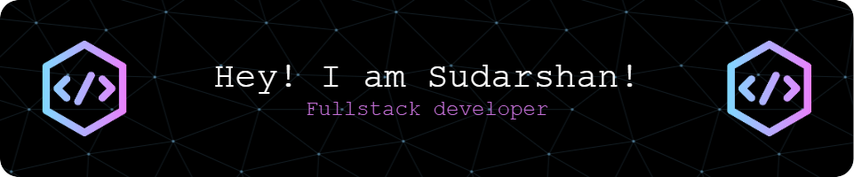

###
<h1 align="left"></h1>

  

###

  
  
  
  
  
  
  

###

  

###

<h1 align="center"></h1>

###

<h3 align="center">👩‍💻  About Me :</h3>

###

I'm Sudarshan Raveendranath from Sri Lanka  - 📚 I'm currently learning Java, C, C++, Kotlin, Flutter, Firebase, SQL, AI, Ethical Hacking, Linux - ⚡ In my free time I study kali linux and ethical hacking

###

<h1 align="left"></h1>

###

<h3 align="center">🛠 Language and tools</h3>

###

  
  
  
  
  
  
  
  
  
  
  
  
  
  
  
  
  
  
  
  
  
  
  
  
  
  
  
  
  
  
  
  
  
  
  
  
  
  
  
  
  
  
  
  
  
  
  
  
  
  
  
  
  
  
  
  
  
  
  
  
  

###

<h1 align="left"></h1>

###

<h3 align="center">🔥   My Stats :</h3>

###

  
  
  

###

<h1 align="left"></h1>

